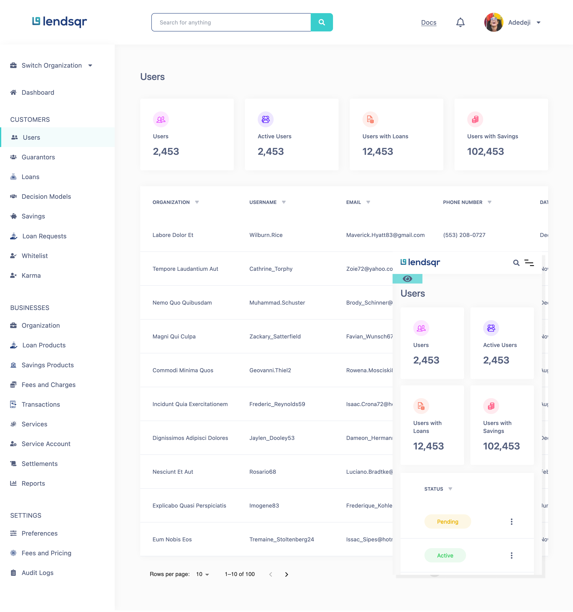

# Lendsqr Frontend Engineer lendsqr-fe-test solution

This is a solution to [lendsqr-fe-test given by Lendsqr ](). To prepare for me as a possible frontend engineer at Lendsqr.

## Table of contents

- [Overview](#overview)
  - [The challenge](#the-challenge)
  - [Screenshot](#screenshot)
  - [Links](#links)
- [My process](#my-process)
  - [Built with](#built-with)
  - [What I learned](#what-i-learned)
  - [Continued development](#continued-development)
- [Author](#author)

## Overview

### The challenge

Users should be able to:

### Given a design on figma which has sample pages to be built.

- Build the 4 pages Login, Dashboard, User page, User details page
- The user pages should pull data from a mock api with 500 records
- Use local storage or indexedDB to store and retrieve user details on the user details page.
- The page must be mobile responsive
- Some details are intentionally left out of this instruction set. We feel the candidate should be able to spot and address them

### Screenshot

### Links

- Live Site URL: [live site URL here]()

## My process

### Built with

- Semantic HTML5 markup
- Typescript
- Tailwind - Although i have used scss on other project i was too excited to start working on the project i forgot the scss requirement and used tailwind
- CSS Grid
- Mobile-first workflow
- [React](https://reactjs.org/) - JS library
- [Next.js](https://nextjs.org/) - React framework
- [Dexie indexDB](https://dexie.org/) - For database

## Author

- Twitter - [@saniojoshua](https://www.twitter.com/saniojoshua)
- LinkedIn - [@joshysmart](https://www.linkedin.com/in/joshysmart/)
